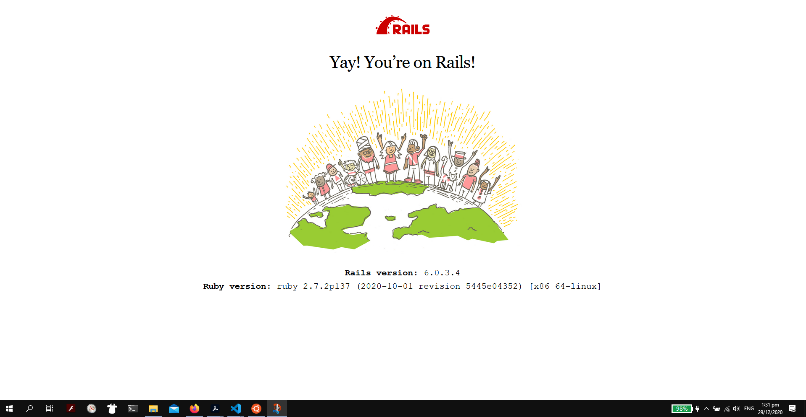

# CVWO-API-SERVER

Name: Lee En Hao

Matriculation Number: A0204679W

This repository coontains my server.

## Heroku API URL

The backend api url domain is https://cvwo-rails-api.herokuapp.com/. The main HTTP routes are:

- GET all tasks: api/v1/tasks
- GET specific tasks: api/v1/tasks/:id
- POST new tasks: api/v1/tasks
- PUT updated task: api/v1/tasks/:id
- DELETE task: api/v1/tasks/:id

The backend rails was done with the Rails::API. The backend repository is separated from the frontend repository for deployment convenience and better separation of concerns.

Third Party Gems used:

* [Figaro](https://github.com/laserlemon/figaro)
* [Faker](https://github.com/faker-ruby/faker) (DevDependency)
* [JsonApi-Serializer](https://github.com/jsonapi-serializer/jsonapi-serializer)

## Screenshot

For the 30th December deliverables.

